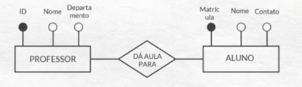

## [1] ENTENDIMENTO DO PROBLEMA  

Entender o problema que o banco de dados quer resolver  
Quais informações seriam mais importantes ?  
De que forma elas se relacionam?  
 

## [2] MER - MODELO ENTIDADE RELACIONAMENTO  

Entendido o problema, vamos definir as entidades, atributos e relacionamentos.  

EXEMPLO ENTIDADE:  
Aluno  
Professor  
  
EXEMPLO DE ATRIBUTO:  
Número da matricula  
Nome  
Email  
  
EXEMPLO RELACIONAMENTO:  
Professor "da aula para" Aluno
  

## [3] DER - DIAGRAMA ENTIDADE RELACIONAMENTO  

Definidas as entidades, atributos e relacionamentos, cria-se um diagrama visual para descrever de forma simples o modelo 
 

  

## [4] DEFINIÇÃO DAS CARDINALIDADES  

Um aluno pode ter aula com mais de 1 professor?  
Um professor pode dar aula para mais de 1 aluno?  
Descrevemos esses relacionamentos por meio das cardinalidades.  
 

## [5] DEFINIÇÃO DO MODELO LÓGICO  

Apos definidos MER e DER, Traduzire-mos as entidades, atributos e relacionamentos em tabelas, compostas por linhas e colunas  
  
ENTIDADE = TABELA  
ATRIBUTO = COLUNAS DA TABELA  
RELACIONAMENTO = FORMA COMO AS TABELAS VÃO SE RELACIONAR  
 

## [6] NORMALIZAÇÃO DAS TABELAS  

[NORMALIZAÇÕES DE TABELAS](formasNormais)

## [7] DICIONÁRIO DE DADOS  

Documento que ajuda a registrar toda a lógica pensada na criação das tabelas, entidades, atributos e relacionamentos.  
  
**[Facilitando manutenções futuras]**   
 

## [8] IMPLEMENTAÇÃO DO MODELO FÍSICO E REALIZAÇÃO DE TESTES  

Apos todas as etapas concluídas, passaremos tudo para a linguagem SQL.  

Com modelo físico pronto, é muito importante realizar uma série de testes para garantir que nenhum detalhe importante foi deixado de lado.  

